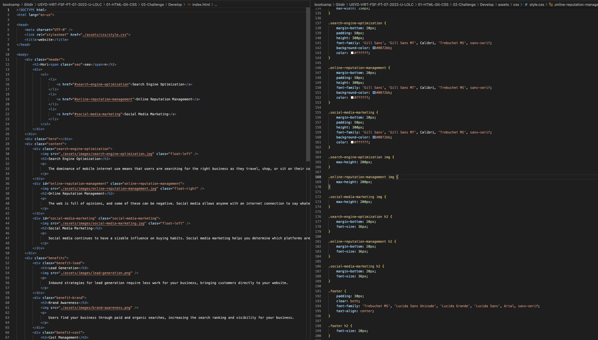

# First Challenge!

## Description

This is our first challenge of the bootcamp. In a nutshell, the objective of this first challenge was to clean up a given website code.
  
The major issues I saw were based on unnecessary and duplicated specificities in HTML and CSS.

My approach was to simplify the style sheet as much as possible wothout compromising the end result. Consequently, this ended up simplifying the HTML as well.

## Table of Contents

My README is not long in this specific case. But for good practise purposes, I will keep the original framework shown in this example.

- [Installation](#installation)
- [Comparison](#comparison)
- [Credits](#credits)
- [License](#license)

## Installation

No installation is required. The code is currently deployed in github pages! The end result can be appreciated by just accessing the page.

[First Challenge][(https://ivoveloso.github.io/First-Challenge/)]

## Comparison

Add pictures of before and after HTML and CSS

Before CSS and HTML

After CSS and HTML

## Credits

This challenge is part of a Bootcamp by University of Sydney and Trilogy.

The source code was initially provided by the abovementioned entities and modified by me.

## License

MIT License

Copyright (c) 2022 [Ivo Veloso]

Permission is hereby granted, free of charge, to any person obtaining a copy
of this software and associated documentation files (the "Software"), to deal
in the Software without restriction, including without limitation the rights
to use, copy, modify, merge, publish, distribute, sublicense, and/or sell
copies of the Software, and to permit persons to whom the Software is
furnished to do so, subject to the following conditions:

The above copyright notice and this permission notice shall be included in all
copies or substantial portions of the Software.

THE SOFTWARE IS PROVIDED "AS IS", WITHOUT WARRANTY OF ANY KIND, EXPRESS OR
IMPLIED, INCLUDING BUT NOT LIMITED TO THE WARRANTIES OF MERCHANTABILITY,
FITNESS FOR A PARTICULAR PURPOSE AND NONINFRINGEMENT. IN NO EVENT SHALL THE
AUTHORS OR COPYRIGHT HOLDERS BE LIABLE FOR ANY CLAIM, DAMAGES OR OTHER
LIABILITY, WHETHER IN AN ACTION OF CONTRACT, TORT OR OTHERWISE, ARISING FROM,
OUT OF OR IN CONNECTION WITH THE SOFTWARE OR THE USE OR OTHER DEALINGS IN THE
SOFTWARE.

---
